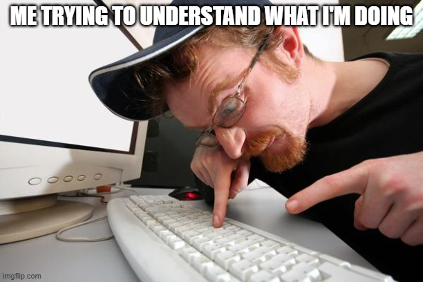

<!-- Improved compatibility of back to top link: See: https://github.com/othneildrew/Best-README-Template/pull/73 -->

<!--
*** Thanks for checking out the Best-README-Template. If you have a suggestion
*** that would make this better, please fork the repo and create a pull request
*** or simply open an issue with the tag "enhancement".
*** Don't forget to give the project a star!
*** Thanks again! Now go create something AMAZING! :D
-->

<!-- PROJECT LOGO -->
 

  <a href="https://github.com/HansPeter21/Praktikum?tab=readme-ov-file">
    

  <h3 align="center">Projekt AI</h3>

  

    A creative creation
     
  

  
Inhaltsverzeichnis

  <ol>
    <li>
      <a href="#about-the-project">Über das Projekt</a>
      <ul>
        <li><a href="#built-with">Overview</a></li>
      </ul>
    </li>
    <li><a href="#roadmap">Roadmap</a></li>
    <li><a href="#contact">Contact</a></li>
    <li><a href="#memes">Memes</a></li> <!-- Link to Memes section -->
  </ol>

<!-- ABOUT THE PROJECT -->
## Über das Projekt
The goal of this projekt is to learn a lot of interesting things and have fun. 😉

(<a href="#readme-top">back to top</a>)

<!-- MEMES -->
## Overview

 

    
  

(<a href="#readme-top">back to top</a>)

<!-- ROADMAP -->
## Roadmap

- [x] Foundations of AI 🌱
    - [x] Basic Concepts: Introduction to AI, ML, and Deep Learning terminology
    - [x] Tools: Python, Jupyter Notebooks basics
    - [x] Projects: Simple scripts and calculations
    - [x] Duration: 2–3 weeks

- [ ] Machine Learning Principles ⚙️
    - [ ] Supervised Learning 📊
        - [ ] Classification: Decision Trees, k-Nearest Neighbors
        - [x] Regression: Linear Regression, SVMs
    - [ ] Unsupervised Learning 🧩
        - [ ] Clustering: k-means, Hierarchical Clustering
        - [ ] Dimensionality Reduction: PCA, t-SNE
    - [ ] Tools: `scikit-learn`
    - [ ] Projects: Prediction, classification tasks using real datasets
    - [ ] Duration: 6–8 weeks

- [ ] Reinforcement Learning 🎮
    - [ ] Core Concepts: Q-Learning, decision-making under uncertainty
    - [ ] Tools: `OpenAI Gym`
    - [ ] Projects: Building a simple game-playing agent (e.g., Tic-Tac-Toe, CartPole)
    - [ ] Duration: 4–6 weeks

- [ ] Deep Learning 🌌
    - [ ] Neural Networks 🧠
        - [ ] Artificial Neural Networks (ANN): Basics of neural networks
        - [ ] Deep Neural Networks (DNN): Complex pattern recognition
    - [ ] Convolutional Neural Networks (CNN) 🖼️
        - [ ] For Image Processing: Object and image recognition tasks
    - [ ] Recurrent Neural Networks (RNN) ⏳
        - [ ] For Sequence Data: Time series analysis and NLP basics
    - [ ] Tools: `TensorFlow`, `PyTorch`
    - [ ] Projects: Image classification, sentiment analysis, time-series forecasting
    - [ ] Duration: 10–12 weeks

- [ ] Transformers and NLP 🚀
    - [ ] Transformer Models: Attention mechanism, Self-Attention
    - [ ] Large Language Models (LLMs): GPT, BERT
    - [ ] Natural Language Processing (NLP): Language processing and analysis
    - [ ] Tools: `Hugging Face Transformers`, `spaCy`
    - [ ] Projects: Text generation, Named Entity Recognition, Chatbot creation
    - [ ] Duration: 8–10 weeks

- [ ] Advanced Topics and Community Engagement 🌐
    - [ ] Specialization: Dive deeper into Computer Vision, NLP, or Time-Series
    - [ ] Projects: Engage in Kaggle competitions, contribute to open-source projects
    - [ ] Continued Learning: Conferences, workshops, and advanced online courses
    - [ ] Duration: Ongoing

 

    
  

(<a href="#readme-top">back to top</a>)

(<a href="#readme-top">back to top</a>)

<!-- CONTACT -->
## Contact

Projekt Link: [https://github.com/HansPeter21/Praktikum.git](https://github.com/HansPeter21/AI_Overview.git)

(<a href="#readme-top">back to top</a>)

<!-- MEMES -->
## Memes
 

    
  </a>
    
  <!-- GIF -->
  
  </a>
    
  

(<a href="#readme-top">back to top</a>)

<!-- MARKDOWN LINKS & IMAGES -->
<!-- https://www.markdownguide.org/basic-syntax/#reference-style-links -->

[pandas.py]: https://numfocus.org/wp-content/uploads/2016/07/pandas-logo-300.png
[Next-url]: https://numpy.org/
[React.js]: https://img.shields.io/badge/React-20232A?style=for-the-badge&logo=react&logoColor=61DAFB
[React-url]: https://reactjs.org/

Dieses Projekt steht unter der MIT-Lizenz - siehe LICENSE Datei für Details.